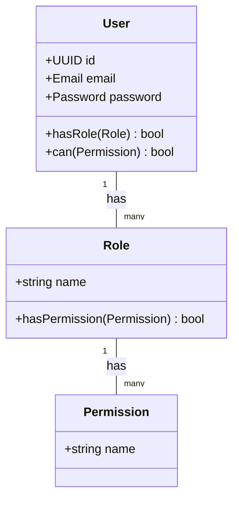

```mermaid
classDiagram
    class User {
        +UUID id
        +Email email
        +Password password
        +hasRole(Role) bool
        +can(Permission) bool
    }

    class Role {
        +string name
        +hasPermission(Permission) bool
    }

    class Permission {
        +string name
    }

    User "1" -- "many" Role : has
    Role "1" -- "many" Permission : has
```
