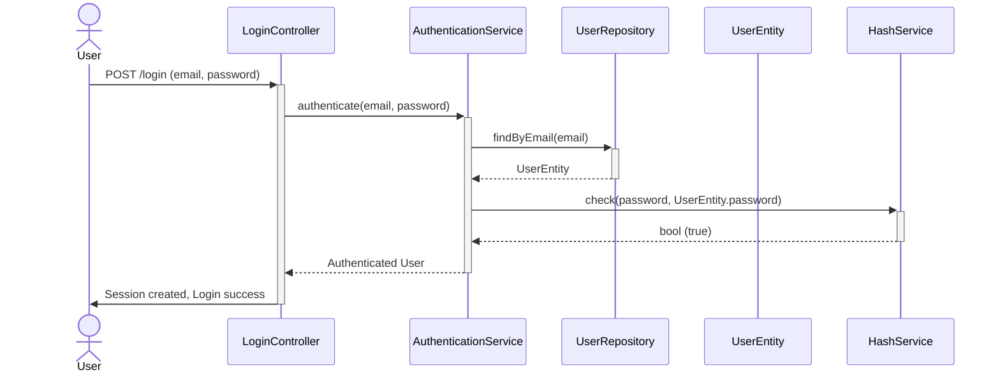

```mermaid
sequenceDiagram
    actor User
    participant LoginController
    participant AuthenticationService
    participant UserRepository
    participant UserEntity
    participant HashService

    User->>+LoginController: POST /login (email, password)
    LoginController->>+AuthenticationService: authenticate(email, password)
    AuthenticationService->>+UserRepository: findByEmail(email)
    UserRepository-->>-AuthenticationService: UserEntity
    AuthenticationService->>+HashService: check(password, UserEntity.password)
    HashService-->>-AuthenticationService: bool (true)
    AuthenticationService-->>-LoginController: Authenticated User
    LoginController->>-User: Session created, Login success
```
