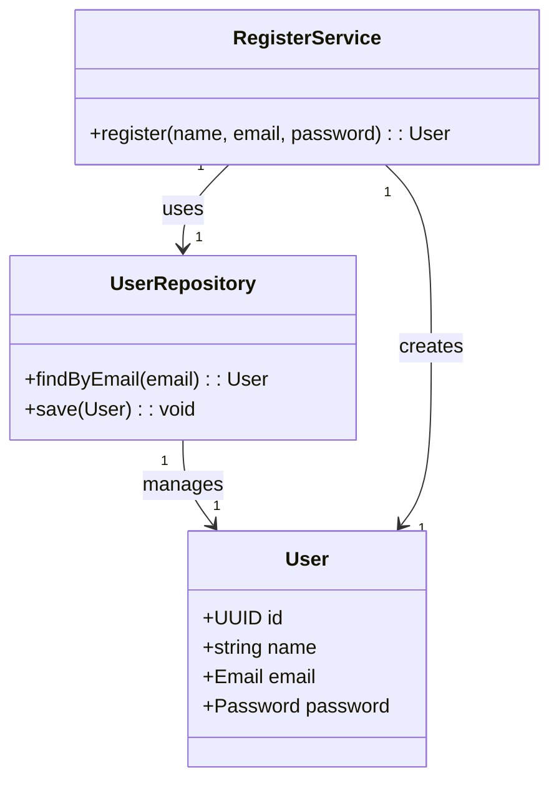

```mermaid
classDiagram
    class RegisterService {
        +register(name, email, password): User
    }
    class UserRepository {
        +findByEmail(email): User
        +save(User): void
    }
    class User {
        +UUID id
        +string name
        +Email email
        +Password password
    }

    RegisterService "1" --> "1" UserRepository : uses
    UserRepository "1" --> "1" User : manages
    RegisterService "1" --> "1" User : creates
```
