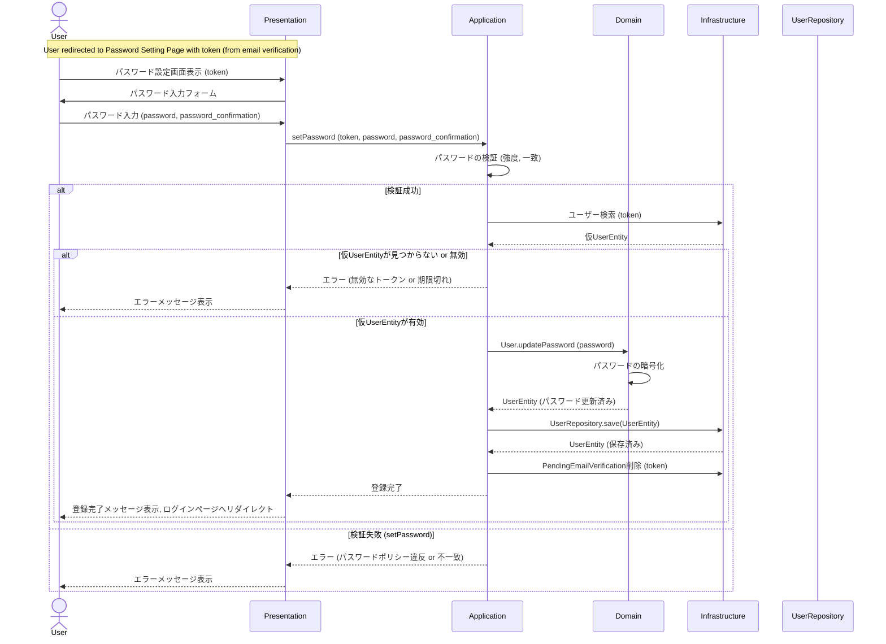

### パスワード登録シーケンスの説明:

1.  **パスワード設定ページへのリダイレクト:** ユーザーはメール認証完了後、トークン付きでパスワード設定ページへリダイレクトされます。
2.  **ユーザーによるパスワード入力:** `User` は `Presentation` レイヤー (パスワード設定フォーム) に、設定したいパスワードと確認用パスワードを入力します。
3.  **Presentation から Application へ:** `Presentation` レイヤーはこのリクエスト (トークン、パスワード、確認用パスワード) を `Application` レイヤー (`SetPasswordUseCase` のようなユースケース) に転送します。
4.  **Application によるパスワードの検証とユーザー更新:**
    *   `Application` レイヤーは、提供されたパスワードがセキュリティポリシーを満たしているか、および確認用パスワードと一致するかを検証します。
    *   トークンを使用して、対応する仮 `User` エンティティを `Infrastructure` レイヤー経由で検索します。
    *   仮 `User` エンティティが見つからない、または無効な場合（例: トークンが期限切れ）、エラーを返します。
    *   有効な `User` エンティティが見つかった場合、`Domain` レイヤーを通じてその `User` エンティティのパスワードを更新し、暗号化します。
    *   `Application` レイヤーは、更新された `User` エンティティを `Infrastructure` レイヤーの `UserRepository` を介して永続化します。
    *   必要に応じて、`PendingEmailVerification` レコードも削除します（メール検証ステップでまだ削除されていない場合）。
5.  **Application から Presentation へ:** 処理が成功した場合、`Application` レイヤーは登録完了のステータスを `Presentation` レイヤーに返します。失敗した場合は、適切なエラーメッセージを返します。
6.  **ユーザーへのフィードバックとリダイレクト:**
    *   `Presentation` レイヤーは、登録が成功したことを `User` に表示し、ログインページへリダイレクトします。
    *   失敗した場合は、エラーメッセージを `User` に表示します。
