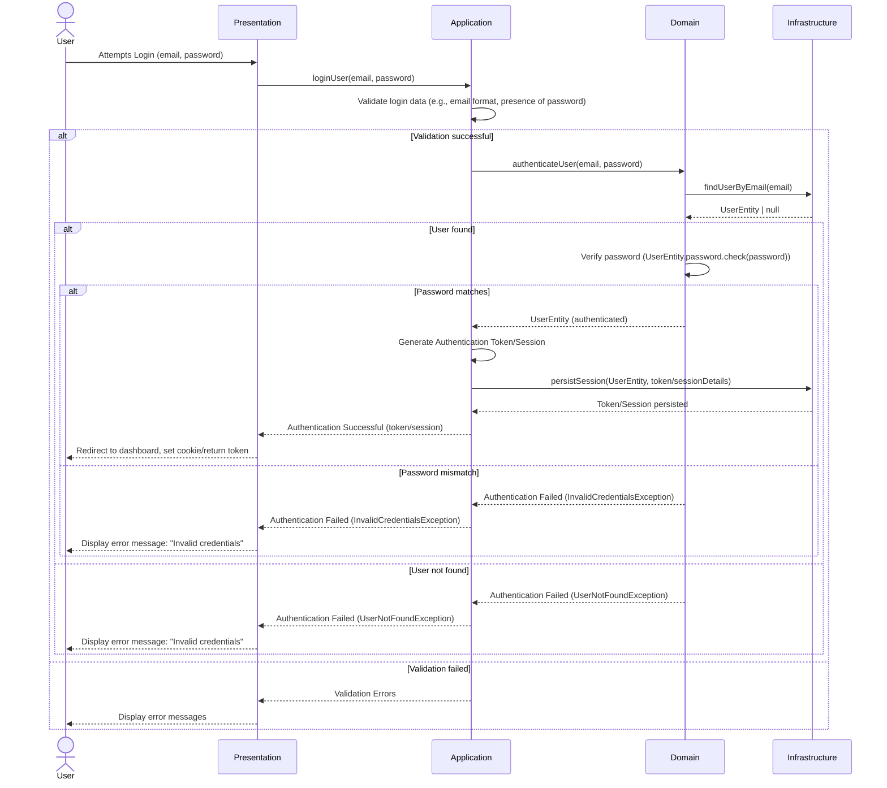

### Explanation of the User Login Sequence:

1.  **User initiates Login:** The `User` provides their email and password to the `Presentation` layer.
2.  **Presentation to Application:** The `Presentation` layer forwards the login request to the `Application` layer (`LoginUserUseCase`).
3.  **Application Validation:** The `Application` layer validates the input (e.g., email format).
4.  **Domain Authentication:** If validation passes, the `Application` layer invokes the `Domain` layer's `authenticateUser` logic.
5.  **Infrastructure User Retrieval:** The `Domain` layer uses the `Infrastructure` layer (via `UserRepositoryInterface`) to find the `User` by their email.
6.  **Password Verification:** If the user is found, the `Domain` layer uses the `User` entity's own behavior (`UserEntity.password.check(password)`) to verify the provided password. This keeps password logic encapsulated within the `User` entity and its `Password` Value Object.
7.  **Authentication Token/Session Generation:** If authentication is successful, the `Application` layer generates an authentication token or establishes a session.
8.  **Infrastructure Session/Token Persistence:** The `Application` layer then instructs the `Infrastructure` layer to persist this session or token.
9.  **Presentation Response:** The `Application` layer returns the authentication result (e.g., the token or a success indicator) to the `Presentation` layer.
10. **User Feedback:** The `Presentation` layer redirects the `User` or returns the token, indicating a successful login.
11. **Error Handling:** If validation fails, the user is not found, or the password doesn't match, appropriate exceptions are thrown and handled, resulting in error messages displayed to the `User` (often generalized as "Invalid credentials" for security reasons).
