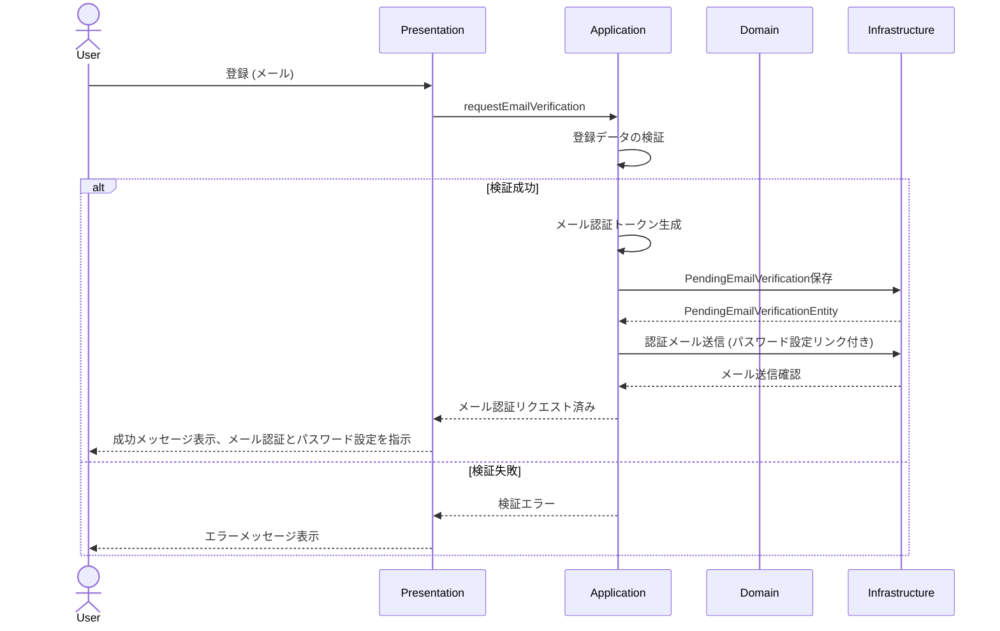

### ユーザー登録シーケンスの説明:

1.  **ユーザーによる登録開始:** `User` は `Presentation` レイヤー (例: ウェブフォーム) にメールアドレスのみを提供します。
2.  **Presentation から Application へ:** `Presentation` レイヤーはこのリクエストを `Application` レイヤー (特に `RequestEmailVerificationUseCase` のようなユースケース) に転送します。
3.  **Application による検証:** `Application` レイヤーはまず、受信したメールアドレス (例: メールの形式、メールの一意性) を検証します。
4.  **メール認証トークンの生成と登録保留メール認証の保存:** 検証が成功した場合、`Application` レイヤーはメール認証トークンを生成し、メールアドレスとトークンを含む登録保留メール認証レコードを `Infrastructure` レイヤーに保存するよう指示します。この段階ではパスワードは設定されず、正式な `User` エンティティもまだ作成されません。
5.  **認証メールの送信:** `Application` レイヤーは、生成されたトークンとパスワード設定ページへのリンクを含む認証メールを `Infrastructure` レイヤーに送信するよう指示します。
6.  **Infrastructure によるメール送信:** `Infrastructure` レイヤーが実際のメール送信を処理します。
7.  **Application からの確認 & Presentation への応答:** `Application` レイヤーはメール送信を確認し、`Presentation` レイヤーにメール認証がリクエストされ、パスワード設定のためにメール認証を待っていることを通知します。
8.  **ユーザーへのフィードバック:** `Presentation` レイヤーは `User` に成功メッセージを表示し、メールをチェックしてパスワードを設定するよう指示します。
9.  **エラーハンドリング:** いずれかの時点で検証が失敗した場合、適切なエラーメッセージが各レイヤーを通じて `User` に返されます。
