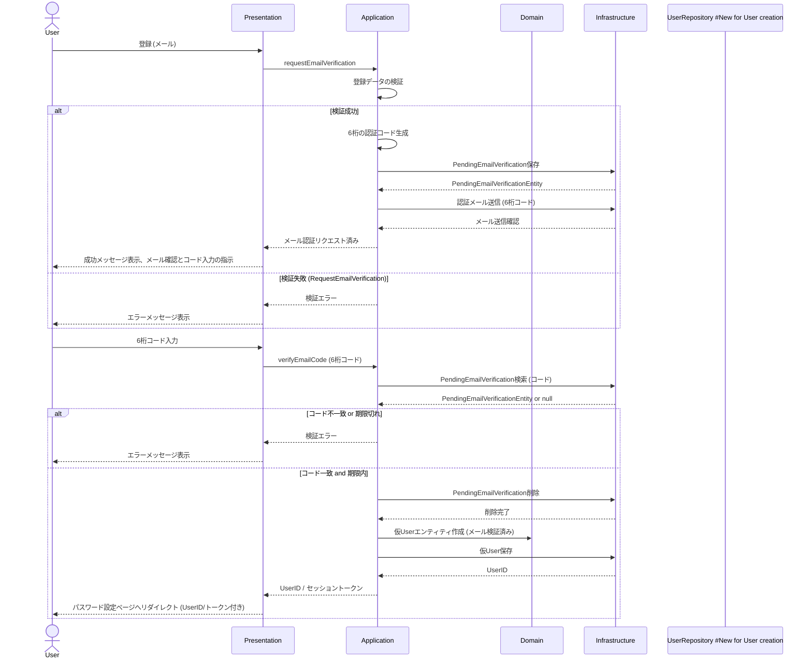

### ユーザー登録シーケンスの説明:

1.  **ユーザーによる登録開始:** `User` は `Presentation` レイヤー (例: ウェブフォーム) にメールアドレスのみを提供します。
2.  **Presentation から Application へ:** `Presentation` レイヤーはこのリクエストを `Application` レイヤー (特に `RequestEmailVerificationUseCase` のようなユースケース) に転送します。
3.  **Application による認証コードの発行と送信:** `Application` レイヤーは、ユーザー認証に必要な認証コードを発行し、ユーザーに送信します。
4.  **6桁の認証コードの生成と登録保留メール認証の保存:** 検証が成功した場合、`Application` レイヤーは6桁の認証コードを生成し、メールアドレスとこのコードを含む登録保留メール認証レコードを `Infrastructure` レイヤーに保存するよう指示します。この段階ではパスワードは設定されません。
5.  **認証メールの送信:** `Application` レイヤーは、生成された6桁の認証コードを含む認証メールを `Infrastructure` レイヤーに送信するよう指示します。
6.  **Infrastructure によるメール送信:** `Infrastructure` レイヤーが実際のメール送信を処理します。
7.  **ユーザーによるコード入力と検証リクエスト:** `User` は `Presentation` レイヤーに受信した6桁の認証コードを提供し、検証をリクエストします。
8.  **Presentation から Application へ (VerifyEmailUseCase):** `Presentation` レイヤーはこのリクエストを `Application` レイヤー (新しい `VerifyEmailUseCase` のようなユースケース) に転送します。
9.  **Application による認証コードの検証と仮 `User` の作成:** `Application` レイヤーは、提供されたコードが `PendingEmailVerification` レコードと一致し、かつ有効期限内であることを検証します。検証に成功した場合、対応する `PendingEmailVerification` レコードを削除し、**パスワード未設定の仮 `User` エンティティを作成します。この `User` エンティティはメール検証済みとしてマークされます。**
10. **Application から Presentation へ:** `Application` レイヤーは、作成された仮 `User` のID（またはパスワード設定用のセッショントークン）を `Presentation` レイヤーに返します。
11. **ユーザーへのフィードバックとパスワード設定へのリダイレクト:** `Presentation` レイヤーは `User` に成功メッセージを表示し、受け取ったID（またはセッショントークン）を使用してパスワード設定ページへリダイレクトします。
12. **エラーハンドリング:** いずれかの時点で検証が失敗した場合、適切なエラーメッセージが各レイヤーを通じて `User` に返されます。
