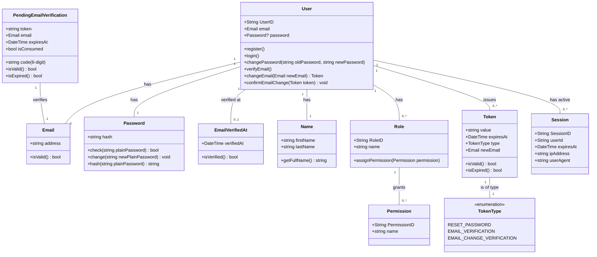

### 設計選択の説明:

*   **エンティティ (User, Role, Permission, Session):** これらのオブジェクトは、時間と異なる表現を通じて永続的な独自の識別子を持ちます。それらは可変であり、複雑な状態と振る舞いを持つことができます。特に `User` エンティティは、メール検証後、パスワードが設定されるまでの仮の状態でも存在し得ます。
*   **値オブジェクト (Email, Password, EmailVerifiedAt, Name, Token, TokenType, PendingEmailVerification):** これらのオブジェクトは、ドメインの記述的な側面を表し、概念的な識別子を持ちません。それらは一度作成されると不変であり、その属性によって比較されます。
    *   `Email` と `Password` は、それぞれ特定の検証ロジックとハッシュ化ロジックをカプセル化するための明示的な値オブジェクトです。
    *   `EmailVerifiedAt` は、メール認証の状態とタイムスタンプを明確に表す値オブジェクトです。
    *   `Name` も、名/姓のロジックとフルネーム表現をカプセル化する値オブジェクトです。`User` エンティティは `Name` を持つように設計されていますが、初期登録プロセスでは必須ではなく、後で設定することができます。
    *   `Token` は、その識別子が文字列値と目的（例: 特定のパスワードリセットトークン）に密接に関連しており、通常は短命で特定の目的のために発行されると不変であるため、ここでは値オブジェクトとしてモデル化されています。`TokenType` は明確性のためのEnumです。
    *   `PendingEmailVerification` は、完全な `User` エンティティの作成とパスワード設定の前に、最初のメールのみの登録ステップ中にメール、一意な識別子としてのトークン、ユーザーに送信される6桁の認証コード、および検証済みかどうかを示すフラグを保存する一時的なエンティティ/値オブジェクトです。
*   **関係性:**
    *   `User` は1つの `Email`、1つの `Name` を持ち、オプションで1つの `Password` を持ちます（パスワードは後から設定される場合があります）。
    *   `User` は `EmailVerifiedAt` を持つ場合があります（オプション）。
    *   `User` は複数の `Role` を持つことができます。
    *   `Role` は複数の `Permission` を付与することができます。
    *   `User` は複数の `Token` を発行することができます（パスワードリセット、メール認証など様々な目的のため）。
    *   `User` は複数のアクティブな `Session` を持つことができます。
    *   `Token` は意味的な明確性のために `TokenType` に関連付けられています。
    *   `PendingEmailVerification` エンティティは `Email` を認証します。

このモデルは、DDD（ドメイン駆動設計）の原則を使用して `Authenticate` モジュールを実装するための強力な基盤を提供し、ID、状態、振る舞いの間の関心を分離します。また、将来のアプリケーション層とインフラストラクチャ層での実装のための明確な境界を設定します。
